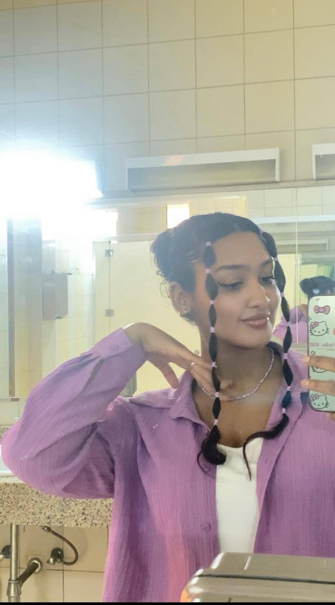
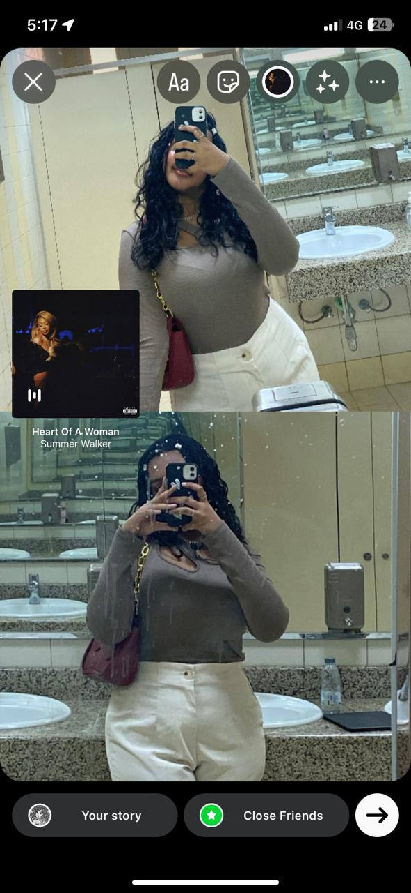
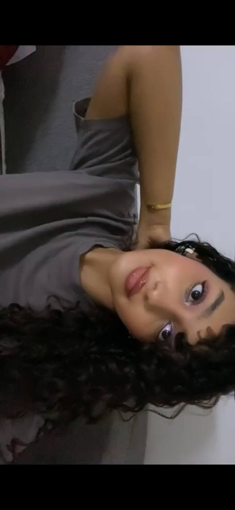

<html lang="ar" dir="rtl">

<head>
  <meta charset="UTF-8">
  <meta name="viewport" content="width=device-width, initial-scale=1.0">

  <title>Happy Birthday هبه ❤️</title>

  
</head>

<body>

  <!-- النجوم -->
  

  <!-- القلوب -->
  

  <!-- =====================================================
  شاشة القفل
  ====================================================== -->

  

    

      

        AUGUST 22
      

      <h1 class="lock-title">
        ❤️ هبة ❤️
      </h1>

      

        شيء جميل ينتظرك...
         
        لكن عليك الانتظار قليلًا.
      

      <!-- العد التنازلي -->

      

        

          00
          يوم
        

        

          00
          ساعة
        

        

          00
          دقيقة
        

        

          00
          ثانية
        

      

      <!-- كلمة السر -->

      

        

          🔒 كلمة السر مطلوبة
        

        

          <input
            type="password"
            id="passwordInput"
            placeholder="أدخل كلمة السر"
            autocomplete="off"
          >

          <button
            id="unlockButton"
            onclick="unlockSite()"
          >
            فتح ❤️
          </button>

        

        

          كلمة السر غير صحيحة ❤️
        

      

      <!-- التلميح الذي يظهر عند انتهاء العد -->

      

        I …….. you
      

    

  

  <!-- =====================================================
       الموقع الأصلي بالكامل
       مخفي إلى أن يتم إدخال كلمة السر
  ====================================================== -->

  

    <!-- البداية -->

    <section class="hero">

      

        

          AUGUST 22
        

        <h1>
          Happy Birthday هبه
        </h1>

        

          Happy Birthday
        

        

          إلى أجمل شخص في العالم وأعلى هدية له
        

        

          اسحب للأسفل ↓
        

      

    </section>

    <!-- العداد -->

    <section>

      <h2 class="section-title">
        اليوم الكبير 🎂
      </h2>

      

        المتبقي على 22 أغسطس
      

      

        

          00
          يوم
        

        

          00
          ساعة
        

        

          00
          دقيقة
        

        

          00
          ثانية
        

      

    </section>

    <!-- الرسالة الأولى -->

    <section>

      <h2 class="section-title">
        رسالة لأجمل شخص في الدنيا 💌
      </h2>

      

        

          في يوم مثل هذا قبل سنوات ولدت أجمل إنسانة في الدنيا
        

         

        

          فرح وسعادة وهبه لكل شخص حولها
        

         

        

          كل عام وأنتِ بخير هبوشي، وأتمنى تكون سنواتك الجاية كلها سعادة وفرح وتحققي كل أهدافك
        

      

    </section>

    <!-- الصور -->

    <section>

      <h2 class="section-title">
        أجمل بنوتة في الدنيا 📸
      </h2>

      

        

          
        

        

          
        

        

          
        

        

          
        

        

          
        

      

    </section>

    <!-- الفيديو -->

    <section>

      <h2 class="section-title">
        for my baby
      </h2>

      

        <video controls playsinline>

          <source
            src="4_5778680816603241723.MP4"
            type="video/mp4"
          >

          المتصفح لا يدعم تشغيل الفيديو.

        </video>

      

    </section>

    <!-- الهدية -->

    <section class="gift-section">

      <h2 class="section-title">
        One Last Thing...
      </h2>

      

        🎁
      

      

        

          

            كل عام وأنتِ بخير يا هبة.
          

           

          

            أتمنى أن تكون هذه السنة أجمل من كل السنوات اللي قبلها،
            وأن تبقى ابتسامتك موجودة للأبد.
          

        

        <!-- الرسالة الثانية -->

        

          

            أحبك
          

           

          

            أحبك أكثر من كل شيء، أنتِ أجمل شخص دخل حياتي.
          

           

          

            من يوم تعرفت عليكِ وأنا حاس بالتغيير اللي صار في حياتي.
          

           

          

            كل يوم وكل لحظة أقضيها معك تملأني فرح،
            وأتمنى دائمًا إن اللحظات ذي تدوم وأقدر أكون معك لآخر يوم.
          

           

          

            أنتِ هبتي وأغلى شيء عندي.
          

           

          

            مرة أحبك. ❤️
          

        

        

          وهذه هدية صغيرة ما هي إلا طريقة بسيطة أقول لك إنك شخص مميز.
        

      

    </section>

    <footer>
      ❤️
    </footer>

    <!-- الموسيقى -->

    

      <button
        onclick="toggleMusic()"
        id="musicButton"
      >
        ▶
      </button>

      
        Heaven Can Wait
      

      <audio
        id="backgroundMusic"
        loop
      >

        <source
          src="Michael-Jackson-Heaven-Can-Wait-Official-Audio-128Kbps-44KHz%20%281%29.mp3"
          type="audio/mpeg"
        >

      </audio>

    

  

  <!-- =====================================================
       JAVASCRIPT
  ====================================================== -->

  

</body>

</html>
